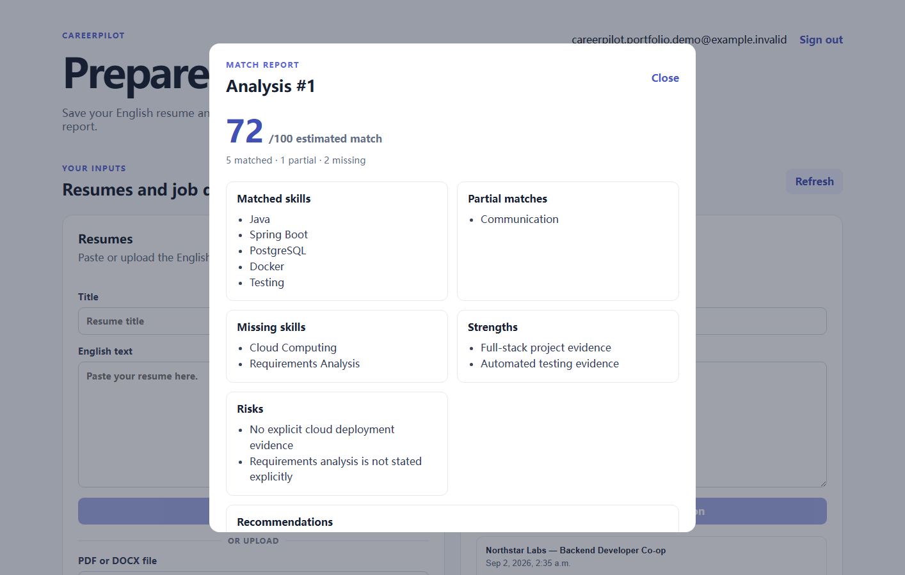

# CareerPilot

CareerPilot is an evidence-grounded job-application preparation workspace. It turns an owned Resume and job description into a validated
match report, a persisted preparation plan, and evidence-aware interview questions without inventing
experience, tools, metrics, or outcomes.



Hosted read-only demo: [careerpilot.hermanlidev.com](https://careerpilot.hermanlidev.com)

The hosted environment contains only a fixed synthetic Resume, job description, report, plan, and interview
question set. AI calls, uploads, registration, report creation, and other persistent mutations are disabled.

Core capabilities:

- Cookie-authenticated accounts with per-user data isolation;
- pasted Resume/JD CRUD plus safe PDF/DOCX Resume text extraction;
- structured parsing, canonical skill-gap matching, and a 0–100 estimated match;
- SSE report progress, persisted plans, task updates, regeneration, and archived-task isolation;
- evidence-grounded interview questions and non-persistent Resume clarity review;
- validated model output, deterministic safe fallbacks, privacy-safe logging, and AI-optional local startup.

See the [portfolio guide](docs/portfolio-guide.md) for the architecture, screenshots, safety boundaries, and a
3–5 minute demonstration script. Product and engineering decisions are documented in [`docs/`](docs/).

The public demo is deployed on a small DigitalOcean host behind an HTTPS reverse proxy. See the
[read-only demo deployment guide](docs/deployment-guide.md) for the verified topology and update procedure.
The production Compose stack exposes only its frontend Nginx on host loopback, creates an isolated synthetic
account on startup, keeps AI off, and rejects non-whitelisted writes in both Nginx and the backend.

## Local startup

Prerequisites: Java 21, Node.js/npm, Docker Desktop (or PostgreSQL 16), and ports 5432, 8123, and 3000.

In PowerShell, start PostgreSQL with a local-only password:

```powershell
$env:CAREERPILOT_DB_PASSWORD='choose-a-local-password'
docker compose up -d postgres
```

In the repository root, enable Flyway for the local database and start the backend. CareerPilot defaults to
AI-disabled mode, so a model key is not required for authentication, CRUD, PDF/DOCX extraction, or reading
previously saved results:

```powershell
$env:CAREERPILOT_DB_PASSWORD='choose-a-local-password'
$env:CAREERPILOT_DB_MIGRATION_ENABLED='true'
.\mvnw.cmd spring-boot:run
```

In a second terminal, start the Vue application on the default allowed development origin:

```powershell
cd careerpilot-frontend
npm install
npm run dev -- --host localhost --port 3000
```

Open `http://localhost:3000/`. If port 3000 is unavailable, choose another frontend port and set
`CAREERPILOT_CORS_ALLOWED_ORIGINS` to that exact origin before starting the backend.

To use live parsing, new match reports, or new interview-question generation, explicitly enable AI in the
backend terminal and provide the provider key through the environment:

```powershell
$env:CAREERPILOT_AI_ENABLED='true'
$env:DASHSCOPE_API_KEY='your-key'
.\mvnw.cmd spring-boot:run
```

In AI-disabled mode, new parsing, Analysis, and Interview Preparation requests safely return
`503 AI_UNAVAILABLE` without creating partial lifecycle records. Resume Review and plan operations retain their
documented deterministic fallback behavior. Never write a real key or database password into repository files.

## Verification

```powershell
.\mvnw.cmd test
cd careerpilot-frontend
npm run build
```

Default automated tests use deterministic fakes and do not call a live model.

GitHub Actions runs the same backend test suite plus normal and read-only-demo frontend builds on pushes and
pull requests. CI validates the deployable artifact; it does not publish secrets or deploy to a third party.
