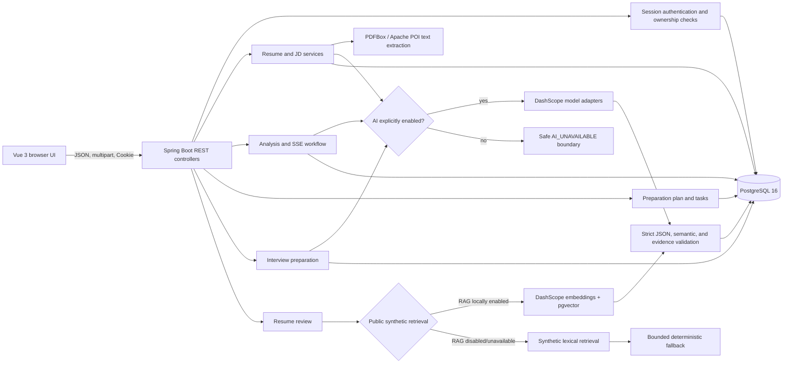
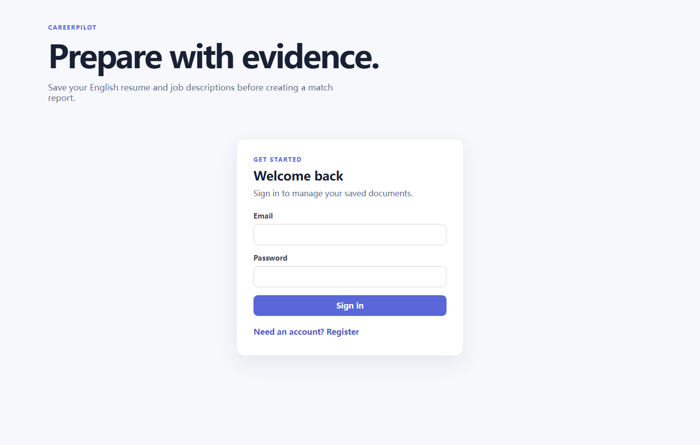
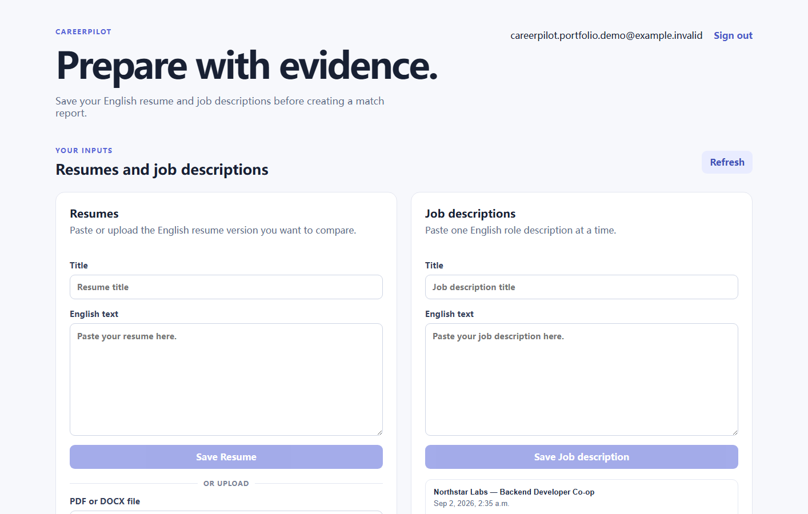
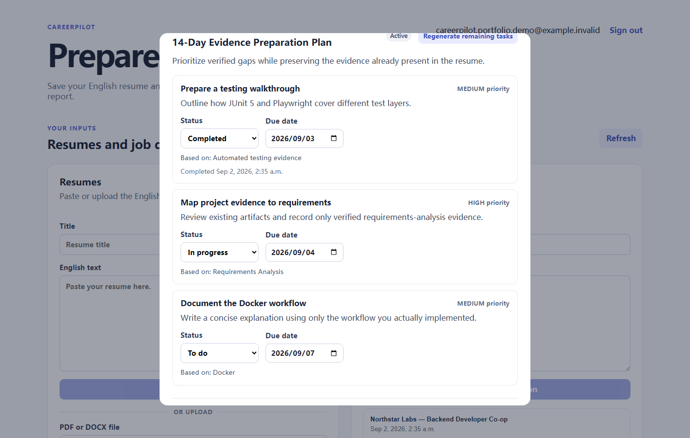
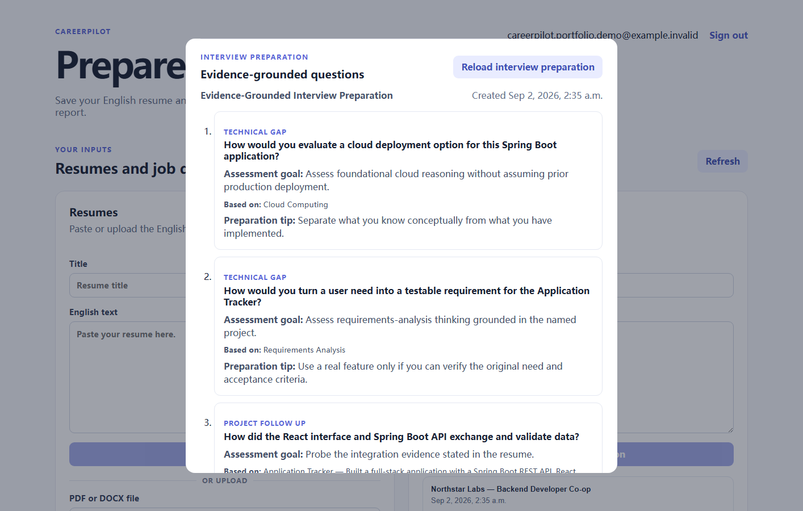
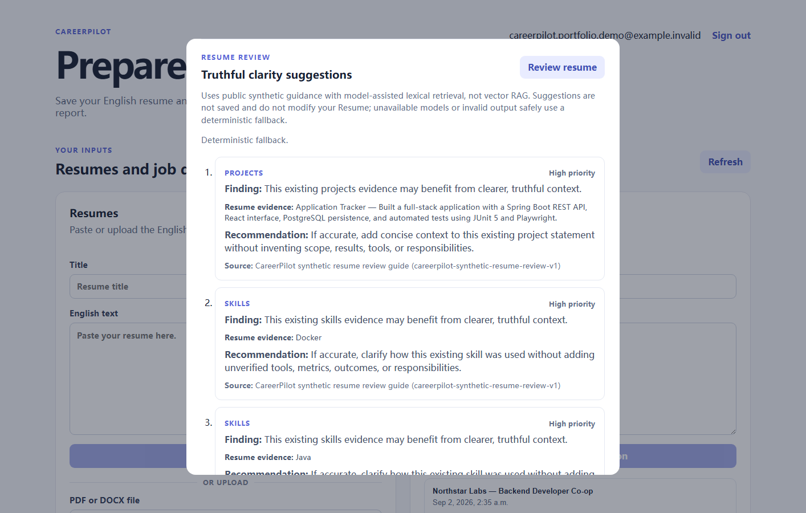

# CareerPilot portfolio guide

Status: PORT-01 completed on 2026-09-02; hosted synthetic demo verified through DEPLOY-02 on 2026-09-11

## What the project demonstrates

CareerPilot is a modular-monolith web application for evidence-grounded job-application preparation. A user
owns every Resume, job description, Analysis, plan, task, and interview session they create. The application
separates untrusted source text, validated structured data, generated reports, and persisted action items.

CareerPilot's product flow, contracts, schema, validation, tests, UI, and deployment are documented here.

The strongest engineering stories are:

- safe PDF/DOCX ingestion that stores extracted text but not the original file;
- strict JSON and semantic validation before model output can be persisted;
- deterministic fallback where a bounded, evidence-safe answer is preferable to a failed or unsafe model output;
- authenticated ownership checks at repository/service boundaries;
- plan regeneration that preserves completed work and archives replaced unfinished tasks;
- AI-optional startup that keeps non-model workflows usable and rejects model-required writes before partial state exists.

## Architecture



The application remains one Spring Boot deployment and one PostgreSQL schema. The optional Resume Review vector
path uses pgvector in that existing database; there is no Redis, queue, microservice, separate vector database,
or autonomous tool runtime.

### Hosted read-only demo

The public portfolio deployment is available at
[careerpilot.hermanlidev.com](https://careerpilot.hermanlidev.com). It runs on a small DigitalOcean Ubuntu host:
Cloudflare provides DNS only, a BaoTa-managed host Nginx terminates Let's Encrypt TLS, and the proxy forwards to
the Docker frontend on `127.0.0.1:18080`. The backend and PostgreSQL remain private on the Compose network.

Public mode contains only the seeded `example.invalid` fixture, disables live AI and RAG, hides mutation
controls, and rejects writes independently at Nginx and backend boundaries. It demonstrates the existing report,
plan, interview-question, and ephemeral lexical/deterministic Resume Review flows without accepting visitor
data.

## Screenshots

All screenshots below were captured from the real Vue UI and Spring Boot API using an isolated PostgreSQL
database, an `example.invalid` account, and synthetic Resume/JD text. Live AI was disabled; no personal Resume,
provider credential, proprietary guide, or existing user record was used.

### Sign in and owned workspace





The workspace preserves the pasted-text flow and adds PDF/DOCX Resume upload. Original files are not stored;
the interface states the 5 MiB limit and the lack of OCR/scanned-PDF support.

### Validated match report


The score is labeled as an estimate and is accompanied by matched, partial, and missing evidence plus risks and
recommendations. Invalid or semantically unsupported model output is rejected before persistence.

### Persisted preparation plan



Tasks persist status, due date, and completion time. Regeneration preserves completed/skipped tasks, archives
replaced unfinished work, and keeps at most eight current tasks.

### Evidence-grounded interview questions



Questions retain their type, assessment goal, exact source evidence, and preparation tip. CareerPilot does not
invent an answer or require the user to practise answers inside the site.

### Truthful Resume clarity review



Resume Review retrieves from public synthetic guidance, keeps displayed advice server-owned, returns at most six
diverse suggestions, and does not rewrite or persist the Resume. Local full mode can opt into vector RAG; the
public screenshot intentionally shows the offline deterministic fallback.

## Local startup

### Prerequisites

- Java 21;
- Node.js/npm compatible with the checked-in Vue/Vite project;
- Docker Desktop, or a PostgreSQL 16 instance;
- local ports 5433, 8123, and 3000 available.

### 1. Start PostgreSQL

From the repository root:

```powershell
$env:CAREERPILOT_DB_PASSWORD='choose-a-local-password'
docker compose up -d postgres
```

The Compose volume persists local data. To use an existing database instead, set
`CAREERPILOT_DB_URL`, `CAREERPILOT_DB_USERNAME`, and `CAREERPILOT_DB_PASSWORD` in the backend process.

### 2. Start the backend without AI

```powershell
$env:CAREERPILOT_DB_PASSWORD='choose-a-local-password'
$env:CAREERPILOT_DB_MIGRATION_ENABLED='true'
$env:CAREERPILOT_AI_ENABLED='false'
.\mvnw.cmd spring-boot:run
```

The API is served from `http://localhost:8123/api`. Offline mode supports authentication, owned CRUD,
PDF/DOCX extraction, and reads of existing reports/plans/interview sessions. New parsing, new Analysis, and new
Interview Preparation return the safe `503 AI_UNAVAILABLE` envelope before creating partial state.

### 3. Start the frontend

```powershell
cd careerpilot-frontend
npm install
npm run dev -- --host localhost --port 3000
```

Open `http://localhost:3000/`.

### 4. Optional live-model mode

Stop the backend, then restart it from the same terminal after setting:

```powershell
$env:CAREERPILOT_AI_ENABLED='true'
$env:DASHSCOPE_API_KEY='your-key'
.\mvnw.cmd spring-boot:run
```

To enable the public-synthetic Resume Review vector path, also set
`$env:CAREERPILOT_RAG_ENABLED='true'`. It uses DashScope `text-embedding-v3` with 1024 dimensions and the
existing PostgreSQL pgvector database. Its calibrated default similarity threshold is `0.50`, configurable with
`CAREERPILOT_RAG_SIMILARITY_THRESHOLD`. RAG remains off unless both AI and RAG are explicitly enabled;
retrieval or provider failure returns to lexical/deterministic review behavior. The key stays outside source
control. Default tests and the documented screenshot fixture do not call a live model.

## Three-to-five minute demo

### 0:00–0:30 — State the problem

“A match percentage is not useful if it invents experience. CareerPilot keeps every recommendation tied to
owned Resume/JD evidence and turns verified gaps into concrete preparation work.”

Show the sign-in page and mention Cookie authentication plus per-user repository queries.

### 0:30–1:15 — Ingest inputs safely

Open the workspace. Point out that pasted Resume text remains supported and PDF/DOCX is additive. Explain that
the server checks extension, MIME type, file signature/structure, size, extracted-text length, encryption, and
empty/scanned-PDF outcomes. Only extracted text is saved; there is no original-file storage or OCR.

### 1:15–2:15 — Generate and validate a match report

Select a completed Resume/JD pair and open the report. Call out the 0–100 “estimated match” label, fixed
capability categories, partial matches, and evidence-aware risks. Explain that raw model JSON uses duplicate-field
detection and then schema, semantic, and evidence validation; rejected output never becomes a completed report.

### 2:15–3:00 — Turn gaps into persisted work

Scroll to the 14-day plan. Change a task status or due date. Explain max-eight current tasks and how regeneration
keeps completed/skipped work while archiving replaced unfinished tasks. Mention the deterministic evidence-safe
fallback after two invalid plan generations.

### 3:00–3:40 — Prepare for interviews without fiction

Load Interview Preparation. Show technical-gap, project-follow-up, and behavioral-evidence questions. Point to
the assessment goal, source evidence, and preparation tip. Repeating the call returns the same session; questions
from another user resolve as not found.

### 3:40–4:20 — Review Resume clarity

Open the Resume and select “Review resume.” Explain the default public-synthetic lexical path and the local-only
opt-in vector path: stable guide chunks, DashScope embeddings, pgvector filtering, and server-resolved citations.
The model selects only server-issued rule/evidence IDs; strict validation and deterministic fallback keep
displayed advice truthful. Nothing is saved or automatically rewritten.

### 4:20–5:00 — Close on operational boundaries

Show the hosted read-only demo and deployment topology. Demonstrate that AI and RAG are explicit local
capabilities, not startup prerequisites. End with the current limitations: English text only, PDF/DOCX only, no
OCR, no `.doc`, no original-file storage, no answer scoring/voice workflow, no private knowledge ingestion, and
no visitor data collection.

## Portfolio talking points

- **Why a modular monolith?** The workflows share ownership, transactional state, and one small team boundary;
  queues and microservices would add operational cost without solving a current problem.
- **Why validate after model generation?** Prompts guide behavior but do not enforce it. Persistence accepts only
  structurally valid, semantically bounded, evidence-supported output.
- **Why deterministic fallback?** It keeps the plan/review useful while preserving a predictable safety envelope;
  unavailable model-required creation paths fail before lifecycle state is written.
- **Why an opt-in vector RAG slice?** It demonstrates a real, bounded retrieval contract using only a public
  synthetic guide: stable chunks, 1024-dimensional embeddings, pgvector filtering, citations, and fallback.
  It does not imply that the public demo or private licensed material uses vector retrieval.
- **How is it deployed safely?** An outer HTTPS proxy is the only public entry point; the Docker frontend binds
  to host loopback, backend/database ports remain private, AI and RAG are disabled in public mode, and two
  layers reject writes.
- **What would come next?** Operational maintenance and focused usability improvements only when a concrete
  portfolio need justifies them. Private licensed knowledge ingestion still requires a separate rights and
  privacy design.

## Verification checklist

```powershell
.\mvnw.cmd test
cd careerpilot-frontend
npm run build
git diff --check
```

Before updating screenshots or the hosted demo, verify that the account, Resume/JD text, logs, and browser network
panel contain only synthetic data and no Cookie, token, API key, database password, or full model response. The
current public deployment passed this boundary check on 2026-09-11.
